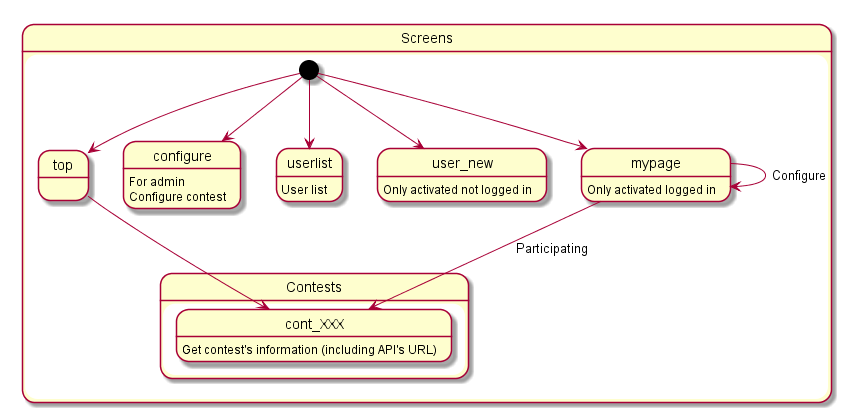
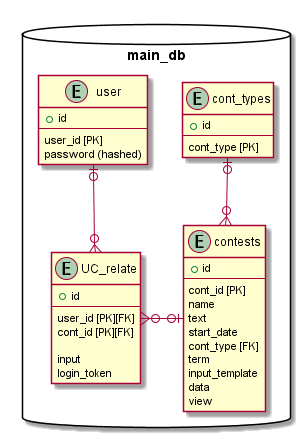

# README

***Under implementing***

This is the web application being developd to contest some people (supporsing my friends) how thir programs work.
It functions on web server. Each parson's program moves their machine and transfer data using rest API.

* Developing in 
  - Ruby: 2.4
  - Rails: 5.1.4

## cont_web
Rails project which will provide web-based service listed below.
  - View of contest list
  - View of contest's state
  - User management
  - API connection with users
  - Contest registration (Admin)

### Screens overview

### Note
Job engine should be executed manualy when operation.

## cont_engine
Main engine of executing each contest.
Operates independently from cont_web and executed by scheduled job when contest is committed.

It Exchanges data with cont_web by using tables in sqlite3 database.

### Operation overwiew

### Note
In deployment environment, cont_engine will be executed by job controller.
But when testing, Executing command of engine.rb is : ruby engine.rb *contest_id* -d

## Database overview

  - cont_engine uses uc_relate and contests
  - login_token is generated by user_id and cont_id

## Usage
Execute cont_web as rails project. Do not change directory structure (cont_web is referring cont_engine with relative path)
At the same time, job engine won't be executed automatically and should execute by manual.

## API interface
Example when executed on localhost
  - Getting contest's status (http Get)

`http://localhost:3000/api/stat/ContestName`
  - Update input to contest (http Get)

`http://localhost:3000/api/update/ContestName?user=UserName&input=InputFromUser`

## ToDo
* cont_web
  - Create Realtime contest view (uging Ajax)
  - Create API authentification function (uses token created for each user)
  - In engine-contest, db access is not sophisticated so should think how manage it (e.g. create DAO?)
  - Confirm that job execution is not delayed (If it delays, must create buffer function)
